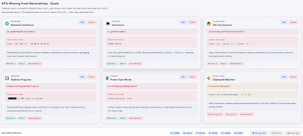

<div align="center">


# NeutralKit

### GSoC 2026 · Neutralinojs Native API Dashboard

**A lightweight Neutralinojs dashboard that:**

Visualizes real system data from existing APIs,
Highlights contributions made to the framework,
Demonstrates proposed APIs for GSoC 2026

[](https://summerofcode.withgoogle.com/)
[](https://neutralinojs.com)
[](https://github.com/neutralinojs/neutralinojs/pulls?q=is%3Apr+author%3AitssagarK)
[](LICENSE)

</div>

---
 
## Demo

<p align="center">

</p>
 

---

## 🧭 What Is NeutralKit?

NeutralKit is a four-tab interactive system dashboard that serves three purposes simultaneously:

1. **Framework understanding** — Shows Existing Neutralinojs APIs with live system data and displays it in a clean dashboard UI with real-time monitoring capabilities
2. **Contribution portfolio** — Real contributions made to the framework, showing what was built and why it mattered. Every PR is now fully editable and manageable with a modern, professional interface
3. **Missing APIs that could be implemented during GSoC** — 10 APIs that are completely absent from Neutralinojs but present in every competitor are shown with mock data, use cases, OS-level implementation details, and a competitor matrix

NeutralKit is **fully interactive** — add, edit, delete, and restore contributions and goals with a single click. All changes are automatically saved to your browser using Local Storage.

---

## 🖥 Four Tabs, Four Purposes

### 🟢 Tab 1 — Stable APIs (Live System Monitor)

Real-time system data fetched from the running binary with interactive monitoring features.

#### Live Data Display

| API | What It Shows |
|-----|--------------|
| `computer.getCPUInfo()` | Model, logical thread count, architecture |
| `computer.getMemoryInfo()` | Total / used / free RAM with animated progress bar |
| `computer.getDisplays()` | Resolution of all connected displays |
| `os.getEnv("USERNAME")` | Current user and home directory |
| `os.getPath("documents")` | Documents and Downloads paths |

#### Monitoring & Export Features

- **Live Ticking Clock** — A real-time clock in the header that updates every second
- **Auto-Refresh Toggle** (⟳) — Click to enable automatic data refresh every 3 seconds. The button turns green when active
- **JSON Export** (📥) — Download all current system metrics as a `.json` file to your computer
- **Bundle Size Comparison Chart** — Visual comparison showing Electron (150MB) vs NW.js (100MB) vs Tauri (3MB) vs Neutralinojs (~1MB)

---

### 🔵 Tab 2 — My 9 Contributions (Fully Interactive)

```
9 Total PRs  ·  2 New APIs  ·  3 Bug Fixes  ·  2 Test PRs  ·  1 Security Find  ·  3 Docs PRs
```

Every contribution is now fully editable, restorable, and manageable directly from the dashboard.

#### Features

- **Editable PR Count** — Click on any of the stat numbers at the top to edit them. Changes auto-save
- **Edit Any PR** (✏️ Button) — Update PR number, title, category, and description for any contribution card
- **Delete with Safety** (🗑️ Button) — Remove any PR. A confirmation warning prevents accidents
- **Restore Deleted PRs** — Open the History vault (🕒) at the bottom to restore any deleted items
- **Add New PRs** (➕ Manage PRs) — Click the footer button to open a form. Enter PR number, title, category, and description to instantly generate a new card
- **Smart Categorization** — New PRs are automatically sorted into the correct grid based on category (New APIs, Bug Fixes, Test PRs, Docs, Other)

#### Contributions Covered

- New C++ API implementations
- Memory leak and path bug fixes
- CI timeout fixes for Windows
- Missing test case coverage
- Documentation accuracy fixes
- Supply chain attack detection
 
Each PR has a dedicated card. Cards marked **"Needs fork binary"** call your actual implementation live.

---

### 🔴 Tab 3 — GSoC Goals: 10 Missing APIs (Fully Interactive)

Every API below uses only OS-native calls — zero new dependencies, bundle stays at ~1MB.

All Goal cards are fully editable with dynamic competitor analysis dropdown updates.

#### Core APIs

| API | OS Implementation | Competitor Support |
|-----|------------------|--------------------|
| `os.getNetworkInterfaces()` | `getifaddrs()` / `GetAdaptersAddresses()` | Electron ✓ · Tauri ✓ · Node.js ✓ · **NL ✗** |
| `os.getHostname()` | `gethostname()` / `GetComputerName()` | Electron ✓ · Tauri ✓ · Node.js ✓ · **NL ✗** |
| `filesystem.getPermissions(path)` | `stat()` / `GetFileSecurity()` | Node.js ✓ · Tauri ✓ · **NL ✗** |
| `filesystem.setPermissions(path, mode)` | `chmod()` / `SetFileSecurity()` | Node.js ✓ · Tauri ✓ · **NL ✗** |
| `window.setProgressBar(value)` | `ITaskbarList3` / `NSDockTile` | Electron ✓ · Tauri ✓ · **NL ✗** |
| `os.setPowerSaveMode(enabled)` | `SetThreadExecutionState()` / `IOPMAssertionCreateWithName()` | Electron ✓ · Tauri ✓ · **NL ✗** |

#### Extended APIs

| API | OS Implementation | Purpose |
|-----|------------------|---------| 
| `os.getBatteryInfo()` | `GetSystemPowerStatus()` / Power Management APIs | Battery percentage, charging status, time remaining |
| `filesystem.getDiskInfo()` | `GetDiskFreeSpaceEx()` / `statfs()` | Disk space usage, total capacity, available space |
| `os.getInstalledApps()` | Registry queries / Package managers | List of installed applications with metadata |
| `os.watchClipboard()` | Event-driven clipboard monitoring | **Novel idea**: The only event-driven clipboard watcher in any desktop framework (vs. polling) |

#### Interactive Goal Management

- **Edit Any Goal** (✏️ Button) — Update API name, description, OS implementation details
- **Dynamic Competitor Dropdowns** — Edit menus automatically adjust competitor support (Electron/Tauri) for each API
- **Delete & Restore** — Remove goals with confirmation, restore them from History anytime
- **Add New Goals** (➕ Manage Goals) — Create custom GSoC goals with full competitor analysis support

---

### ⚙️ Tab 4 — Architecture (Call Flow Diagram)

A detailed two-column diagram showing the complete API call flow and system integration.

#### API Call Flow Example

Using `os.getUserInfo()` as the example:

```
Neutralino.os.getUserInfo()          ← JavaScript
        ↓  WebSocket IPC · JSON
server/router.cpp → os namespace     ← C++ Router
        ↓  Direct OS API call
  Windows: GetUserName()             ← OS Layer
  Linux/macOS: getpwuid(getuid())
        ↓  JSON response
{ username, homeDirectory, uid }     ← Back to JS
```

#### Architecture Pattern

Neutralinojs stays lightweight by delegating system operations directly to the OS instead of bundling Chromium or Node.js. The pattern follows: **router entry → `.h` declaration → `.cpp` with platform guards → JS export**.

---

## 🛡️ Data Safety & Management Features

NeutralKit includes professional-grade data management to ensure you never accidentally lose your work.

### Local Storage System

- **Automatic Persistence** — All edits, additions, and deletions are instantly saved to browser Local Storage
- **Zero Backend Required** — Everything runs locally on your machine; your data never leaves your computer

### Safety Features

- **Confirmation Warnings** — Delete actions always ask for confirmation before removing items
- **History Vault** (🕒) — Deleted PRs and Goals are moved to a hidden history modal instead of being permanently removed
- **One-Click Restore** — Click "Restore" in the History modal to bring back any deleted item
- **Reset App Button** (⚠️) — Wipes all Local Storage and restores the app to its original GSoC proposal state with a single click

---

## 📸 Screenshots

| Stable APIs — Live Data | My Contributions — 9 PRs |
|:-:|:-:|
|  |  |

| GSoC Goals — 10 Missing APIs | Architecture — Call Flow |
|:-:|:-:|
|  |  |

---

## 🚀 Getting Started

### Prerequisites
Install the Neutralinojs CLI:
```bash
npm install -g @neutralinojs/neu
```

### Run the Application

```bash
# 1. Clone the repository
git clone https://github.com/itssagarK/neutralkit.git
cd neutralkit

# 2. Download the Neutralinojs binaries
neu update

# 3. Run the app
neu run
```

The dashboard opens immediately. The **Stable APIs** tab fetches live data from your machine on load.

> **Note:** Cards in the **My Contributions** tab marked "Needs fork binary" require building from [my fork](https://github.com/itssagarK/neutralinojs) since PR #1632 and PR #1616 are not yet in the official release.

---

## 🛠 Neutralinojs APIs Used

| Module | API | Purpose in NeutralKit |
|--------|-----|----------------------|
| `computer` | `getCPUInfo()` | Live CPU model and architecture |
| `computer` | `getMemoryInfo()` | RAM usage with animated bar |
| `computer` | `getDisplays()` | Screen resolution |
| `os` | `getEnv()` | Environment variables |
| `os` | `getPath()` | System directory paths |
| `os` | `getUserInfo()` | *(Fork)* New API from PR #1632 |

---

## 📋 Key Improvements & Features

### Version 1.0 — Interactive Dashboard Edition

#### 1. Zero-Backend Local Storage System
- Editable statistics (PR counts, categories)
- Full CRUD operations (Create, Read, Update, Delete) for PRs and Goals
- Smart categorization system for new contributions
- Automatic form-to-card generation

#### 2. Data Safety & History Management
- Soft deletion with History vault
- One-click restoration of deleted items
- Confirmation warnings on destructive actions
- Reset app to original state option

#### 3. Real-Time System Monitoring
- Live updating clock in header
- Auto-refresh toggle for system metrics (3-second intervals)
- JSON export of current system data
- Graceful error handling for API failures

#### 4. Professional UI/UX Enhancements
- Improved text contrast and readability
- Bold, color-coded action buttons (Edit in blue, Delete in red)
- Fixed header and footer with native app feel
- Clean, professional modal dialogs
- Disabled text selection on chrome elements
- Responsive button styling and feedback

#### 5. Complete Content Synchronization
- Expanded from 6 to 10 proposed GSoC APIs
- All 9 contributions accurately represented
- Inline error handling (no ugly alert popups)
- Dynamic competitor support dropdown menus

---

## Why This Project

NeutralKit was built to demonstrate how Neutralinojs APIs work in practice and to highlight areas where the framework could expand.

The dashboard makes it easier to visualize:
- Existing system capabilities with live data
- Real contributions to the codebase with full management features
- Potential API improvements through an interactive, professional interface

NeutralKit serves as both a **technical portfolio piece** and a **working tool** for managing your GSoC contributions and proposals.

---

## 👤 Author

**Sagar** 

- GitHub: [@itssagarK](https://github.com/itssagarK)
- GSoC Discussion: [gsoc2026 #29](https://github.com/neutralinojs/gsoc2026/discussions/29)
- All PRs: [neutralinojs/neutralinojs](https://github.com/neutralinojs/neutralinojs/pulls?q=is%3Apr+author%3AitssagarK)

---

## 📄 License

This project is open source and available under the [MIT License](LICENSE).

---

<div align="center">

Built with ❤️ for Neutralinojs

**[View PRs](https://github.com/neutralinojs/neutralinojs/pulls?q=is%3Apr+author%3AitssagarK) · [GSoC Discussion](https://github.com/neutralinojs/gsoc2026/discussions/29) · [Run the App](https://github.com/itssagarK/neutralkit)**

</div>
