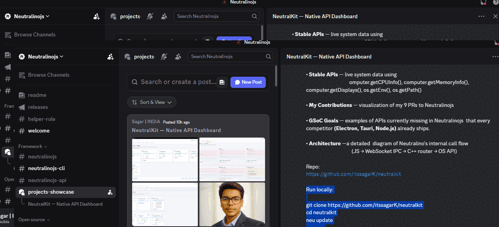
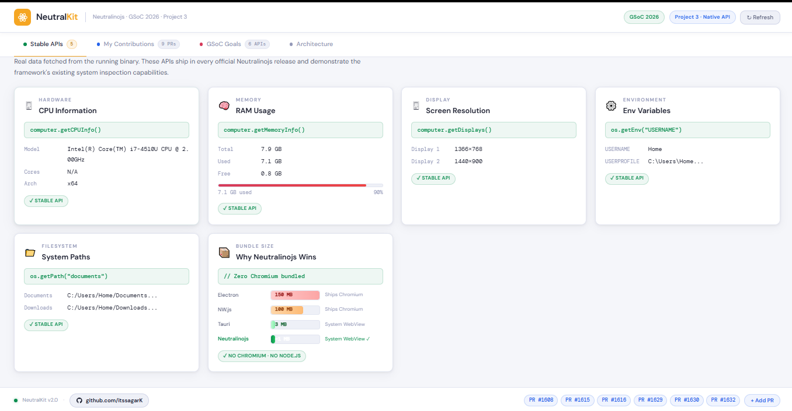
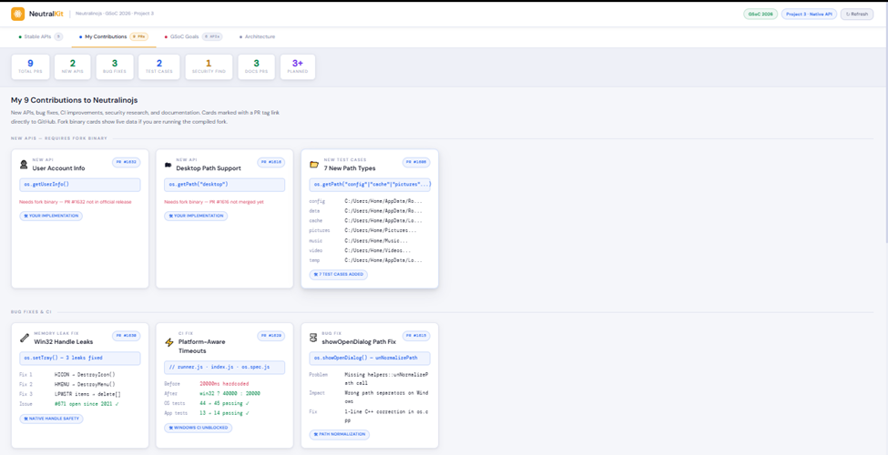
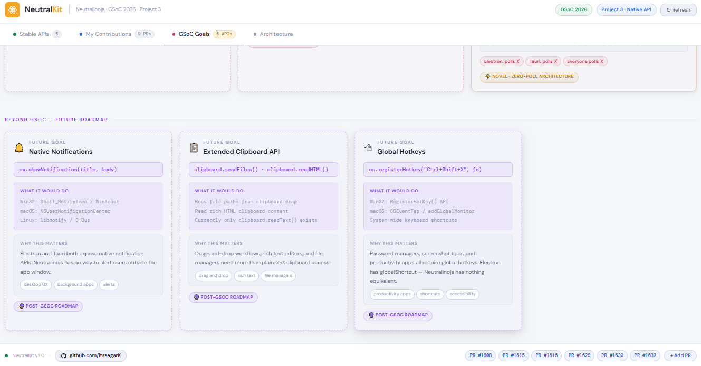
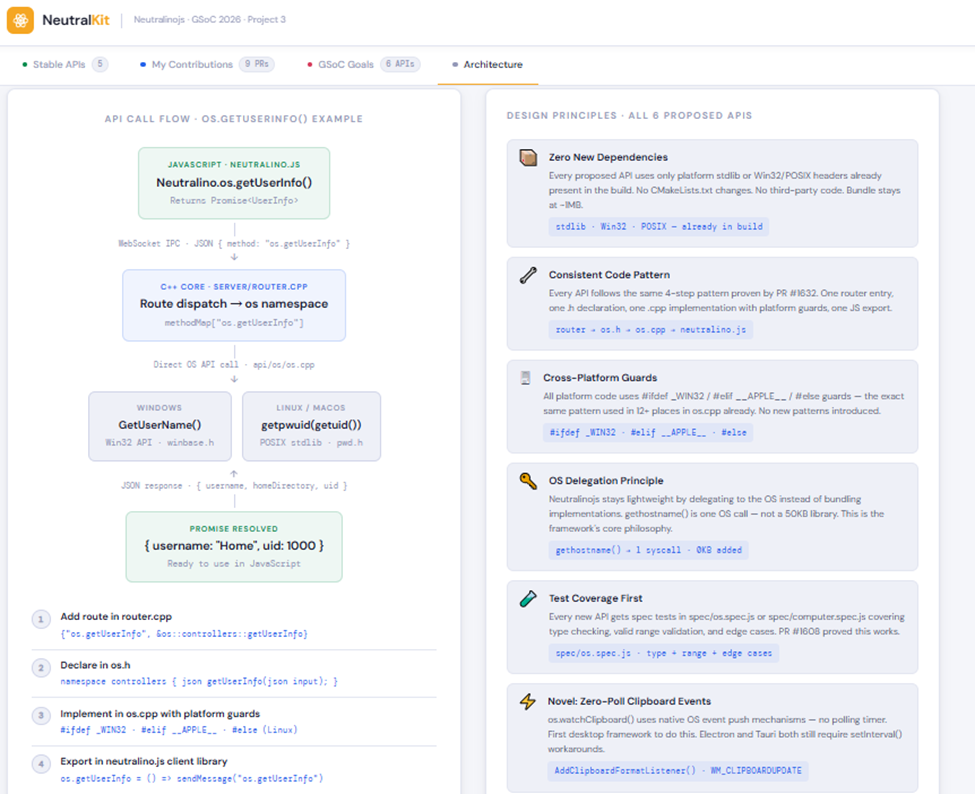

<div align="center">


# NeutralKit

### GSoC 2026 · Neutralinojs Native API Dashboard

**A live system dashboard that visualizes existing Neutralinojs APIs, demonstrates 9 real contributions, and proposes 6 missing APIs — all built with zero Chromium, zero Node.js, ~1MB binary.**

[](https://summerofcode.withgoogle.com/)
[](https://neutralinojs.com)
[](https://github.com/neutralinojs/neutralinojs/pulls?q=is%3Apr+author%3AitssagarK)
[](LICENSE)

</div>

---
 
## Demo

<p align="center">

</p>
 

---

## 📸 Screenshots

| Stable APIs — Live Data | My Contributions — 9 PRs |
|:-:|:-:|
|  |  |

| GSoC Goals — 6 Missing APIs | Architecture — Call Flow |
|:-:|:-:|
|  |  |

---

## 🧭 What Is NeutralKit?

NeutralKit is a four-tab system dashboard that serves three purposes simultaneously:

1. **Proof of framework understanding** — fetches real live data from `computer.getCPUInfo()`, `computer.getMemoryInfo()`, `computer.getDisplays()`, `os.getEnv()`, and `os.getPath()` and displays it in a clean dashboard UI
2. **Contribution portfolio** — every one of my 9 PRs has a dedicated card with live API calls where applicable, showing what was built and why it mattered
3. **GSoC proposal visualizer** — 6 APIs that are completely absent from Neutralinojs but present in every competitor are shown with mock data, use cases, OS-level implementation details, and a competitor matrix

---

## 🖥 Four Tabs, Four Purposes

### 🟢 Tab 1 — Stable APIs
Live data fetched from the running binary the moment the app starts.

| API | What It Shows |
|-----|--------------|
| `computer.getCPUInfo()` | Model, logical thread count, architecture |
| `computer.getMemoryInfo()` | Total / used / free RAM with animated progress bar |
| `computer.getDisplays()` | Resolution of all connected displays |
| `os.getEnv("USERNAME")` | Current user and home directory |
| `os.getPath("documents")` | Documents and Downloads paths |

Also includes a live **bundle size comparison chart** — Electron (150MB) vs NW.js (100MB) vs Tauri (3MB) vs Neutralinojs (~1MB).

---

### 🔵 Tab 2 — My 9 Contributions

```
9 Total PRs  ·  2 New APIs  ·  3 Bug Fixes  ·  2 Test PRs  ·  1 Security Find  ·  3 Docs PRs
```

Highlights contributions across:

- New C++ API implementations
- Memory leak and path bug fixes
- CI timeout fixes for Windows
- Missing test case coverage
- Documentation accuracy fixes
- Supply chain attack detection
 
Each PR has a dedicated card. Cards marked **"Needs fork binary"** call your actual implementation live.

---

### 🔴 Tab 3 — GSoC Goals: 6 Missing APIs

Every API below uses only OS-native calls — zero new dependencies, bundle stays at ~1MB.

| API | OS Implementation | Competitor Support |
|-----|------------------|--------------------|
| `os.getNetworkInterfaces()` | `getifaddrs()` / `GetAdaptersAddresses()` | Electron ✓ · Tauri ✓ · Node.js ✓ · **NL ✗** |
| `os.getHostname()` | `gethostname()` / `GetComputerName()` | Electron ✓ · Tauri ✓ · Node.js ✓ · **NL ✗** |
| `filesystem.getPermissions(path)` | `stat()` / `GetFileSecurity()` | Node.js ✓ · Tauri ✓ · **NL ✗** |
| `filesystem.setPermissions(path, mode)` | `chmod()` / `SetFileSecurity()` | Node.js ✓ · Tauri ✓ · **NL ✗** |
| `window.setProgressBar(value)` | `ITaskbarList3` / `NSDockTile` | Electron ✓ · Tauri ✓ · **NL ✗** |
| `os.setPowerSaveMode(enabled)` | `SetThreadExecutionState()` / `IOPMAssertionCreateWithName()` | Electron ✓ · Tauri ✓ · **NL ✗** |

Also includes a **novel idea**: `os.watchClipboard()` — the only event-driven clipboard watcher in any desktop framework. Electron polls. Tauri polls. Everyone polls. This would use `AddClipboardFormatListener()` on Windows, `XFixesSelectSelectionInput()` on Linux, and `NSPasteboard.changeCount` on macOS.
---

### ⚙️ Tab 4 — Architecture

A detailed two-column diagram showing:

**Left — The full API call flow** (using `os.getUserInfo()` as the example):
```
Neutralino.os.getUserInfo()          ← JavaScript
        ↓  WebSocket IPC · JSON
server/router.cpp → os namespace     ← C++ Router
        ↓  Direct OS API call
  Windows: GetUserName()             ← OS Layer
  Linux/macOS: getpwuid(getuid())
        ↓  JSON response
{ username, homeDirectory, uid }     ← Back to JS
```

Neutralinojs stays lightweight by delegating system operations directly to the OS instead of bundling Chromium or Node.js. Every proposed API follows this same 4-step pattern: router entry → `.h` declaration → `.cpp` with platform guards → JS export.
---

## 🚀 Getting Started

### Prerequisites
Install Neutralinojs CLI :
```bash
npm install -g @neutralinojs/neu
```

### Run locally


```bash
# 1. Clone the repository
git clone https://github.com/itssagarK/neutralkit.git
cd neutralkit

# 2. Download the Neutralinojs binaries
neu update

# 3. Run the app
neu run
```

The dashboard opens immediately. The **Stable APIs** tab fetches live data from your machine on load.

> **Note:** Cards in the **My Contributions** tab marked "Needs fork binary" require building from [my fork](https://github.com/itssagarK/neutralinojs) since PR #1632 and PR #1616 are not yet in the official release.

---

## 🛠 Neutralinojs APIs Used

| Module | API | Purpose in NeutralKit |
|--------|-----|----------------------|
| `computer` | `getCPUInfo()` | Live CPU model and architecture |
| `computer` | `getMemoryInfo()` | RAM usage with animated bar |
| `computer` | `getDisplays()` | Screen resolution |
| `os` | `getEnv()` | Environment variables |
| `os` | `getPath()` | System directory paths |
| `os` | `getUserInfo()` | *(Fork)* New API from PR #1632 |

---


## 👤 Author

**Sagar** 

- GitHub: [@itssagarK](https://github.com/itssagarK)
- GSoC Discussion: [gsoc2026 #29](https://github.com/neutralinojs/gsoc2026/discussions/29)
- All PRs: [neutralinojs/neutralinojs](https://github.com/neutralinojs/neutralinojs/pulls?q=is%3Apr+author%3AitssagarK)

---

## 📄 License

This project is open source and available under the [MIT License](LICENSE).

---

<div align="center">

Built with ❤️ for Neutralinojs · GSoC 2026 · Project 3 — Extending the Existing Native API

**[View PRs](https://github.com/neutralinojs/neutralinojs/pulls?q=is%3Apr+author%3AitssagarK) · [GSoC Discussion](https://github.com/neutralinojs/gsoc2026/discussions/29) · [Run the App](https://github.com/itssagarK/neutralkit)**

</div>
