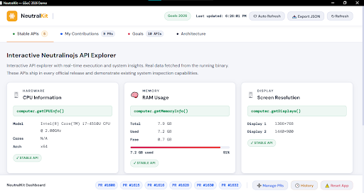
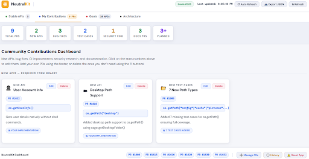

<div align="center">


# NeutralKit

### Neutralinojs Native API Dashboard

A lightweight desktop dashboard built with **Neutralinojs** that visualizes real system data using native APIs, tracks open-source contributions interactively, and demonstrates how capable desktop apps can be without bundling Chromium or Node.js.

[](https://neutralinojs.com)
[](LICENSE)

</div>

---

## Demo

<p align="center">
  
</p>

---

## What Is NeutralKit?

NeutralKit is a four-tab system dashboard that helps you:

1. **Understand Neutralinojs APIs** using live, real system data
2. **Track development and contributions** with full CRUD support
3. **Visualize native desktop architecture** — how lightweight apps can be built efficiently

It serves as both a **technical portfolio piece** and a **working tool** for managing open-source contributions and GSoC progress.

---


## Features

###  System Information — Live Native APIs

Reads real data directly from your OS using Neutralinojs APIs:

| API | Output |
|-----|--------|
| `computer.getCPUInfo()` | CPU model and core details |
| `computer.getMemoryInfo()` | RAM usage (total / available) |
| `computer.getDisplays()` | Screen resolution and display info |
| `os.getEnv()` | Environment variables |
| `os.getPath()` | System-standard directory paths |

Auto-refresh every 3 seconds keeps all metrics live. Data can be exported as JSON at any time.

---

###  Contribution Tracker

- Track PRs and work items with smart categorization
- Add, edit, and delete entries with inline confirmation dialogs
- Visual progress indicators per contribution
- All 9 contributions accurately represented with full management controls

---

###  Goals & Planning

- Add and manage development goals
- Edit or delete with confirmation to prevent accidents
- Track completion status visually
- Restore deleted goals from the History vault

---

###  Architecture View

A detailed two-column diagram showing the complete API call flow and system integration.

**Example — `os.getUserInfo()` call flow:**

```
Neutralino.os.getUserInfo()          ← JavaScript
        ↓  WebSocket IPC · JSON
server/router.cpp → os namespace     ← C++ Router
        ↓  Direct OS API call
  Windows: GetUserName()             ← OS Layer
  Linux/macOS: getpwuid(getuid())
        ↓  JSON response
{ username, homeDirectory, uid }     ← Back to JS
```

Neutralinojs stays lightweight by delegating system operations directly to the OS instead of bundling Chromium or Node.js. The pattern follows:

> **router entry → `.h` declaration → `.cpp` with platform guards → JS export**

---

## Local State & Persistence

NeutralKit is fully interactive with **zero backend required**:

- **`localStorage`** handles all persistence — data survives app restarts
- **Full CRUD** — create, read, update, and delete PRs, goals, and stats
- **History & Recovery** — deleted items move to a History vault with one-click restore
- **Confirmation dialogs** before any destructive action
- **JSON export** of current system snapshot
- **Live clock** in the header
- **Reset to defaults** option available at any time

---

## Screenshots

| System Data | Contributions |
|:-----------:|:-------------:|
|  |  |

| Goals | Architecture |
|:-----:|:------------:|
|  |  |

---
## Getting Started

Install the Neutralinojs CLI:

```bash
npm install -g @neutralinojs/neu
```

Clone and run:

```bash
# 1. Clone the repository
git clone https://github.com/itssagarK/neutralkit.git
cd neutralkit

# 2. Download the Neutralinojs binaries
neu update

# 3. Run the app
neu run
```

---

## Why This Project

NeutralKit was built to demonstrate how Neutralinojs APIs work in practice and to highlight areas where the framework could expand. The dashboard makes it easy to visualize existing system capabilities with live data, real contributions to the codebase with full management features, and potential API improvements through an interactive, professional interface.

---

## Author

**Sagar**

- GitHub: [@itssagarK](https://github.com/itssagarK)
- GSoC Discussion: [gsoc2026 #29](https://github.com/neutralinojs/gsoc2026/discussions/29)
- All PRs: [neutralinojs/neutralinojs](https://github.com/neutralinojs/neutralinojs/pulls?q=is%3Apr+author%3AitssagarK)

---

## License

This project is open source and available under the [MIT License](LICENSE).

---

<div align="center">

Built with ❤️ for Neutralinojs

**[View PRs](https://github.com/neutralinojs/neutralinojs/pulls?q=is%3Apr+author%3AitssagarK) · [GSoC Discussion](https://github.com/neutralinojs/gsoc2026/discussions/29) · [Run the App](https://github.com/itssagarK/neutralkit)**

</div>
